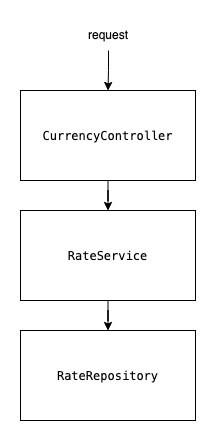

# CurrencyApi
CurrencyApi is a REST-API App that makes operations on different currencies based on the following [CSV file](https://www.ecb.europa.eu/stats/eurofxref/eurofxref-hist.zip).

# Libraries
- `Swagger`
- `Spring boot`
- `OpenCSV`: CSV parser
- `Maven`

# API
- API endpoint: `http://localhost:8080/api/v1/rates`
- Swagger endpoint: `http://localhost:8080/swagger-ui.html`

# How to run
- install maven then run the following command in the projects directory: 
`$ mvn spring-boot:run`
- or run the following two commands: 
```
$ mvn clean package spring-boot:repackage
$ java -jar target/exercise-0.0.1-SNAPSHOT.jar
```


# Code structure
